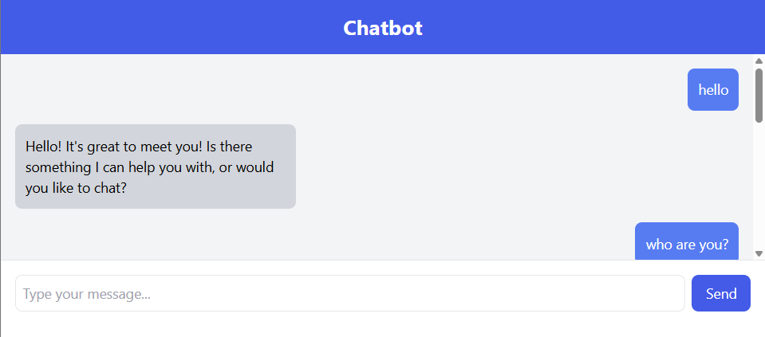

# Demo

# Chatbot web-app

Chatbot web-app integrated with llama 3.2 using ollama.

Front-end: React

Back-end: Django

### Installation
1) activate the virtual environment on the venv folder
   or
   create a new virtual environment and pip install -r requirements.txt
2) navigate to the backend, run on a seperate commandline: python manage.py runserver
3) navigate to the front-end and on cmd: npm start
4) make sure npm is installed.
